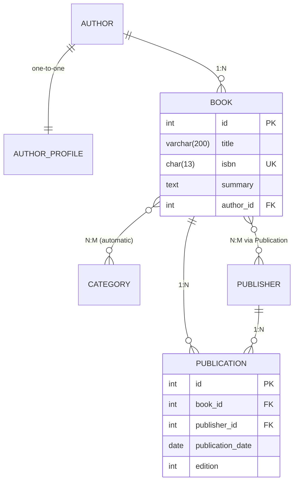

# Laboratorio N° 4 - Relación de Modelos en Django

**Curso:** Desarrollo de Aplicaciones Empresariales (DAE) - Tecsup
**Aplicación:** `library`
**Objetivo:** Implementar los tres tipos de relaciones entre modelos
(`OneToOneField`, `ForeignKey` y `ManyToManyField` con modelo intermedio `through`),
demostrar consultas ORM bidireccionales y verificar experimentalmente el
comportamiento de `on_delete` (`CASCADE` vs `PROTECT`).

---

## 1. Estructura del proyecto

```
semana4/
├── config/                     # Proyecto Django
│   ├── settings.py             # INSTALLED_APPS, media, Pillow
│   └── urls.py                 # Incluye library.urls y sirve medios (static())
├── library/                    # Aplicación
│   ├── models.py               # Author, AuthorProfile, Category, Publisher, Book, Publication
│   ├── admin.py                # Registro en el panel de administración
│   ├── views.py                # book_detail con select_related / prefetch_related
│   ├── urls.py                 # Ruta 'book/<int:pk>/'
│   ├── templates/library/
│   │   └── book_detail.html    # Plantilla de detalle del libro
│   ├── migrations/             # Migraciones generadas
│   └── orm_script.py           # Script de operaciones y pruebas ORM
├── media/authors/              # Fotografías subidas (ImageField)
├── manage.py
├── requirements.txt
└── README.md
```

## 2. Instalación

```bash
python -m pip install -r requirements.txt
cd "cuarto ciclo/semana4"
python manage.py migrate
```

Django y Pillow deben estar instalados (Pillow habilita el campo `ImageField`).

## 3. Relaciones de modelos implementadas

| Modelo | Relación | Tipo | Observaciones |
|---|---|---|---|
| `AuthorProfile.author` | `Author` | `OneToOneField` | `primary_key=True`, `on_delete=CASCADE`, `related_name='profile'` |
| `Book.author` | `Author` | `ForeignKey` | `on_delete=CASCADE`, `related_name='books'` |
| `Book.categories` | `Category` | `ManyToManyField` | `related_name='books'` (tabla intermedia automática) |
| `Book.publishers` | `Publisher` | `ManyToManyField` | `through='Publication'`, `related_name='books'` |
| `Publication.book` | `Book` | `ForeignKey` | `on_delete=CASCADE`, `related_name='publications'` |
| `Publication.publisher` | `Publisher` | `ForeignKey` | `on_delete=CASCADE`, `related_name='publications'` |

### Modelo intermedio `Publication`

Posee atributos propios: `publication_date` (DateField) y `edition`
(`PositiveIntegerField`, default=1), con `unique_together = ('book', 'publisher', 'edition')`.
Permite registrar el historial de ediciones de un libro por editorial.

### Esquema de relaciones (ER)

```
                        ┌──────────────────┐
                        │      Author      │
                        │ id, first_name,  │
                        │ last_name, email │
                        └────────┬─────────┘
                                 │
                  ┌──────────────┴───────────────┐
                  │ 1:1 (OneToOneField)          │ 1:N (ForeignKey)
                  ▼                              ▼
        ┌──────────────────┐          ┌──────────────────────────┐
        │  AuthorProfile   │          │          Book            │
        │ id=author_id (PK)│          │ id, title, isbn, summary │
        │ biography,       │          │ author_id (FK a Author)  │
        │ website, photo   │          └──────┬──────────┬────────┘
        └──────────────────┘                 │          │
                                     N:M      │          │ M:N (through)
                                 ┌───────────┴──┐  ┌─────┴─────┐
                                 │   Category   │  │ Publisher │
                                 │ id, name,    │  │ id, name, │
                                 │ description  │  │ address,  │
                                 └──────────────┘  │ website   │
                                                    └─────┬─────┘
                                                          │ 1:N (ForeignKey)
                                                          ▼
                                          ┌──────────────────────────┐
                                          │    Publication (through) │
                                          │ book_id (FK),            │
                                          │ publisher_id (FK),       │
                                          │ publication_date,        │
                                          │ edition                  │
                                          └──────────────────────────┘
```

Cardinalidades:
- `Author` 1 — 1 `AuthorProfile` (perfil único por autor).
- `Author` 1 — N `Book` (un autor escribe muchos libros).
- `Book` N — M `Category` (varios temas; tabla intermedia automática `book_categories`).
- `Book` N — M `Publisher` a través de `Publication` (un libro lo publican varias
  editoriales en diferentes ediciones y una editorial publica varios libros).
- `Publication` N — 1 `Book` y N — 1 `Publisher` (cada fila del historial enlaza
  un libro con una editorial en una edición concreta).

Versión Mermaid (renderiza en GitHub, VS Code y Obsidian):



### Observaciones sobre las decisiones de diseño

- **`OneToOneField` con `primary_key=True` en `AuthorProfile`**: garantiza que
  cada autor tenga como máximo un perfil y convierte el campo `author` en la
  clave primaria del perfil, eliminando un id redundante. Un perfil no tiene
  sentido sin su autor, por lo que `on_delete=CASCADE` es la opción coherente.
- **`ForeignKey` en `Book.author`**: un libro pertenece a un único autor y el
  `related_name='books'` expone la consulta inversa `author.books.all()`, más
  legible que el `book_set` por defecto.
- **`ManyToManyField` en `Book.categories` sin `through`**: la relación
  libro-categoría es puramente de pertenencia (sin datos extra), por lo que la
  tabla intermedia automática `book_categories` es suficiente.
- **`ManyToManyField` en `Book.publishers` con `through='Publication'`**: se
  necesita registrar atributos de la relación (fecha y edición); una M2M
  automática no permite almacenarlos. Por eso se declara el modelo intermedio
  de forma explícita.
- **`unique_together` en `Publication`**: impide duplicar la misma edición del
  mismo libro en la misma editorial, garantizando un historial consistente.
- **`on_delete=CASCADE` en todos los FKs**: al depender el libro, el perfil y el
  historial de publicación de sus padres, la eliminación en cascada mantiene la
  integridad referencial sin dejar registros huérfanos.
- **`related_name` en todas las FKs y M2M**: nombres explícitos y predecibles
  (`books`, `profile`, `publications`) para la navegación bidireccional del ORM.
- **`ordering` en los `Meta`**: orden por defecto estable (por nombre/título o
  fecha de publicación) que mejora la consistencia en admin, listados y consultas.
- **`select_related` + `prefetch_related` en la vista**: la primera resuelve las
  FK y relaciones 1:1 con `JOIN`; la segunda resuelve las M2M y relaciones
  inversas en lotes. Con esta estrategia `book_detail` ejecuta 4 consultas
  constantes en lugar de una por cada publicación/categoría (problema N+1).

## 4. Configuración de medios (Pillow)

En `config/settings.py`:

```python
INSTALLED_APPS = [..., 'library']

MEDIA_URL = '/media/'
MEDIA_ROOT = BASE_DIR / 'media'
```

En `config/urls.py` se sirven los archivos de medios en desarrollo:

```python
if settings.DEBUG:
    urlpatterns += static(settings.MEDIA_URL, document_root=settings.MEDIA_ROOT)
```

## 5. Vista optimizada (evita el problema N+1)

`library/views.py`:

```python
book = get_object_or_404(
    Book.objects.select_related('author', 'author__profile')
    .prefetch_related('categories', 'publications__publisher'),
    pk=pk,
)
```

- `select_related` une mediante `JOIN` la autoría y su perfil (consultas 1:1 y FK).
- `prefetch_related` recupera en lotes las categorías y las publicaciones con
  su editorial (relaciones muchos-a-muchos y reversas).

Verificado experimentalmente: la vista ejecuta **4 consultas SQL** en total
(1 JOIN libro+autor+perfil, 1 categorías, 1 publicaciones, 1 editoriales),
independientemente del número de publicaciones del libro.

## 6. Ejecución del script de operaciones y pruebas ORM

```bash
python manage.py shell -c "exec(open('library/orm_script.py', encoding='utf-8').read())"
```

El script es idempotente y ejecuta de forma secuencial:

### a) Población inicial
- 2 autores con su perfil (Robert Martin y Andrew Hunt).
- 3 categorías (Software Engineering, Architecture y Agile).
- 2 editoriales (Prentice Hall y Pragmatic Bookshelf).
- 4 libros con autor asignado y categorías asociadas (Clean Architecture
  pertenece a dos categorías).
- 5 instancias del modelo intermedio `Publication` con fecha y edición
  (The Pragmatic Programmer tiene ediciones 1 y 2).

### b) Consultas ORM bidireccionales
| Consulta | Código |
|---|---|
| Ida (Forward) | `Book.objects.get(isbn=...)` → `book.author` y `book.author.profile.website` |
| Inversa (Reverse) | `Author.objects.get(email=...)` → `author.books.all()` vía `related_name='books'` |
| Lookup `__` | `Book.objects.filter(categories__name='Agile')` |
| Lookup `__` | `Book.objects.filter(author__last_name='Martin')` |
| Modelo intermedio | `Publication.objects.filter(publisher__name='Pragmatic Bookshelf')` |

### c) Verificación experimental de `on_delete`
- **CASCADE:** al borrar a Robert Martin se comprueba que sus libros y su perfil
  se eliminan automáticamente (conteos antes/después).
- **PROTECT:** se crea un modelo *scratch* (tabla temporal) con
  `ForeignKey(Author, on_delete=models.PROTECT)`, se inserta un registro y se
  intenta borrar al autor. Se captura `django.db.models.deletion.ProtectedError`
  y se confirma que el autor sigue existiendo. La tabla temporal se elimina al final.
- Al terminar, el script restaura el dataset para dejar la base completa y la
  vista web navegable.

## 7. Verificación de la vista web

```bash
python manage.py runserver
```

Abrir `http://127.0.0.1:8000/book/1/` (el pk del libro deseado) o
`http://127.0.0.1:8000/admin/` para el panel de administración.

La plantilla muestra: título e ISBN del libro, datos del autor (nombre, email y
perfil con sitio web/foto si existe), categorías asociadas y el historial de
`Publication` (editorial, edición y fecha de publicación).

## 8. Conclusión pedagógica

- `OneToOneField` garantiza que cada autor tenga **un único** perfil y el uso de
  `primary_key=True` convierte al FK en la clave primaria del perfil.
- `ForeignKey` modela pertenencia (un libro pertenece a un autor) y la consulta
  inversa se expone con `related_name`.
- `ManyToManyField` con `through` permite registrar **datos propios de la
  relación** (fecha y edición) que una tabla intermedia automática no podría
  almacenar.
- El ORM de Django permite navegar la relación en ambos sentidos y filtrar a
  través de atributos con la sintaxis `__`; `select_related` +
  `prefetch_related` evitan el problema N+1.
- `on_delete` define la integridad referencial a nivel de ORM: `CASCADE` borra
  en cadena mientras `PROTECT` impide el borrado lanzando `ProtectedError`,
  protegiendo los datos referenciados.

## 9. Mapeo a la rúbrica (20/20)

| Criterio | Pts | Evidencia |
|---|---|---|
| Relaciones OneToOne, ForeignKey, ManyToMany | 5 | `library/models.py` secciones 3, 5 y 6 |
| Modelo intermedio con `through` y atributos | 5 | `Publication` con `unique_together` |
| Consultas ORM bidireccionales y `on_delete` | 5 | `library/orm_script.py` sección 6 |
| Código PEP 8, inglés y documentado | 5 | Verificado con `pycodestyle`; este README |